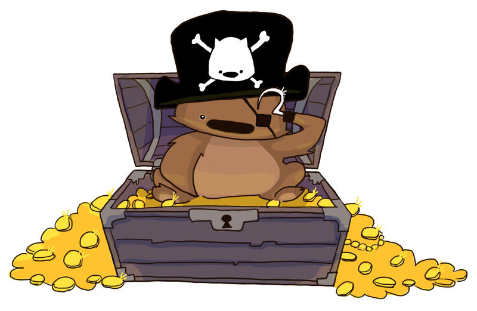

# captain-hook
> a slack bot to subscribe to npm webhook notifications



## usage

```
/captain-hook subscribe <type: package||organization> <name> <sharedsecret>
```

## local dev

`captain-hook` is a NodeJS application. if you don't have [NodeJS]
you'll need to [download it].

`captain-hook` uses a Postgres database.

### up and running

1. Fork and clone this repo
2. `cd captain-hook`
3. `npm install`
4. Copy `.envsample` to `.env` and fill it out

  | variable                   | description                                                                                                                                                                 |
  |------------------ |---------------------------------------------------------------------------------------------------------------------------------------------------------------------------- |
  | SLACK_API_TOKEN   | Bot API token. You can find this on the Slack Developers site by navigating: Browse Apps > Custom Integrations > Bots Configurations on {{team_name}} > Edit configuration  |
  | SLACK_CHANNEL_ID  | Name of the channel, i.e. #testing. Can also be ID number retrieved from the Slack API.                                                                                     |
  | SHARED_SECRET     | Any string.                                                                                                                                                                 |
  | DATABASE_URL      | URL of your Postgres database. defaults to `localhost:5432/dev` |

5. `npm db:setup`, creates a Postgres db, then runs [Knex] migrations and seeds
6. `npm run dev`, runs `npm start` and pipes output to nice logging
  You now have a service running on [`localhost:6666`]. You'll probably want to expose
  that to the internet for local development. [`ngrok`] is a great, free option.

## web interface

the `captain hook` web interface is an express app. it servers basic CRUD functionality for the two resources: `users` and `subscriptions`.

to start it, run `npm run start:web` and then visit [`http://localhost:8080`].

[NodeJS]: https://nodejs.org
[download it]: https://nodejs.org
[`localhost:6666`]: http://localhost:6666
[`ngrok`]: https://ngrok.com/
[Knex]: http://knexjs.org/
[`http://localhost:8080`]: http://localhost:8080
